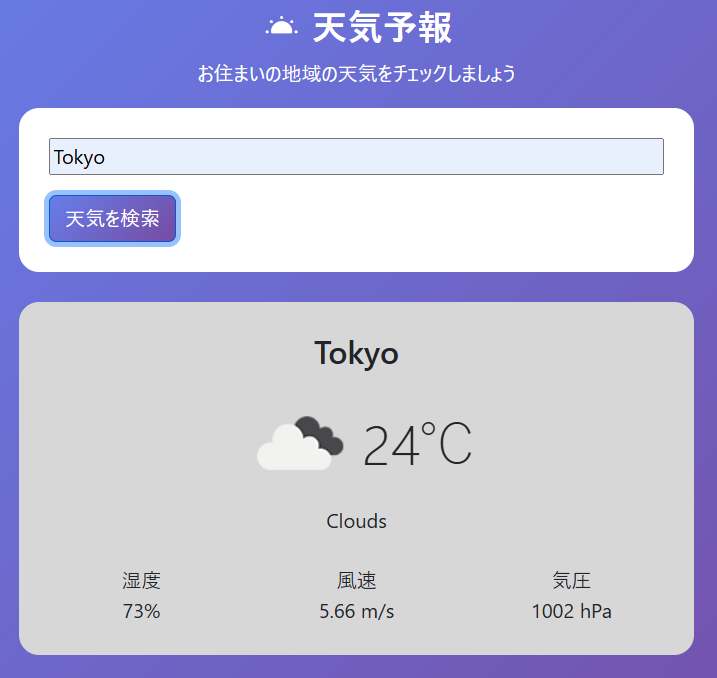

# weather-app-js-practice

## 概要  
このプロジェクトは、Node.js と Express を使いAPIキーを隠しつつ、HTML・CSS・JavaScript（axios利用）で天気情報を取得・表示するシンプルな天気予報アプリです。

API連携や非同期処理の学習を目的として制作しました。

## デモ

## 主な機能  
- 都市名の入力による天気情報の取得  
- 天気アイコン・気温・湿度・風速・気圧の表示  
- エンターキーまたは検索ボタンによる検索  

## 使用技術  
- **フロントエンド**  
  - HTML / CSS（Bootstrap）  
  - JavaScript（axiosを使ったAPI通信）

- **バックエンド**  
  - Node.js  
  - Express